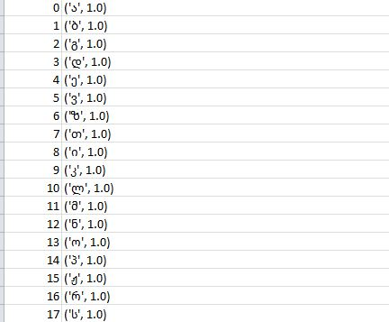

# laba7
Лабораторная работа выполнялась для грузинского алфавита, тип букв - строчные, шрифт - bpg_nino_mtavruli_bold размера 52.
Распознавание строки того же размера
Исходное изображение

Классификация символов
Лучшие гипотезы имеют следующий вид:

Получается следующее предложение:
აიდიდისახლიარისჟრს

Анализ

Классификация для того же размера шрифта работает хорошо, все буквы распознаются.

Распознавание строки меньшего размера
Исходное изображение
 

Классификация символов

Лучшие гипотезы имеют вид:
 

**Анализ**

При уменьшении шрифта точность распознавания немного повышается.
